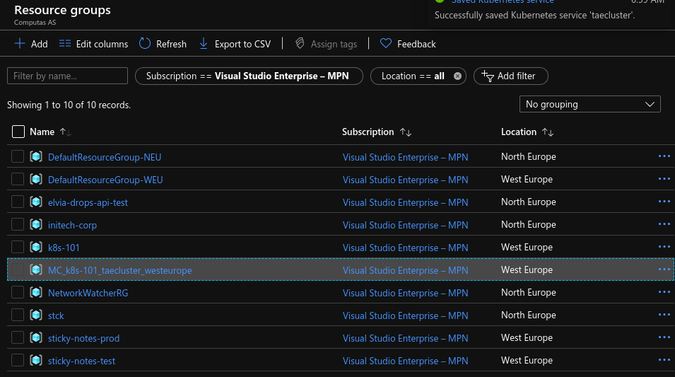
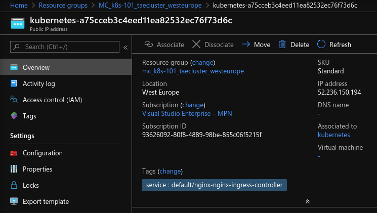

# [Index](index) > Helm, the package manager for Kubernetes

_In this section, we'll introduce Helm, and use it to install NGINX, so we better can control access to the services on our cluster._

## Motivation

In the previous sections, we deployed our Kubernetes app using the kubectl command line application. This was painful because we had to remember to create the deployment and the service each time we wanted to release a new version of our app. If we created any more Kubernetes resources, then we'd have to remember to manually deploy those each time too.

On top of that, we also had to remember to update the dependencies between each component/resource in our Kubernetes manifest files. Like the name of the services, and pods. If we've built some automation around this, then we'd need to update our scripts each time we made any changes to filenames.

The problem is that we have to remember exactly how to deploy the application step by step. Our "application" (i.e, all of our Kubernetes resources packaged together) is something kubectl has no idea about.

## Helm

[Helm](https://github.com/kubernetes/helm) is one of the solutions to this problem. According to the documentation:

> [Helm is a tool for managing Kubernetes charts. Charts are packages of pre-configured Kubernetes resources.](https://github.com/kubernetes/helm#kubernetes-helm)

> [A chart is organized as a collection of files inside of a directory.](https://github.com/kubernetes/helm/blob/master/docs/charts.md#the-chart-file-structure)

In other words, Helm allows us to work from the mental model of managing our "application" on our cluster, instead of individual Kubernetes resources via `kubectl`.

One of the other features of Helm is its ability to use _templates_ in Kubernetes resources that are part of the chart. This means you can define values in one place and share them across multiple Kubernetes resource files.

Another good thing about a common way to deploy a set of resources in kubernetes, is that the default values will be set to whats considered best practice. This default values can of course be overridden be the ones installing the helm-chart.

Before we begin you should understand three key concepts in helm. Read them from the [docs](https://helm.sh/docs/using_helm/#three-big-concepts) or the copy-pasted text below.

### Three key concepts

A **Chart** is a Helm package. It contains all of the resource definitions necessary to run an application, tool, or service inside of a Kubernetes cluster. Think of it like the Kubernetes equivalent of a Homebrew formula, an Apt dpkg, or a Yum RPM file.

A **Repository** is the place where **charts** can be collected and shared. It’s like Perl’s CPAN archive or the Fedora Package Database, but for Kubernetes packages.

A **Release** is an instance of a chart running in a Kubernetes cluster. One chart can often be installed many times into the same cluster. And each time it is installed, a new **release** is created. Consider a MySQL chart. If you want two databases running in your cluster, you can install that chart twice. Each one will have its own **release**, which will in turn have its own **release** name.

With these concepts in mind, we can now explain Helm like this:

Helm installs **charts** into Kubernetes, creating a new **release** for each installation. And to find new **charts**, you can search Helm chart repositories.

If you want to read more about helm, I recommend the [docs](https://helm.sh/docs/).

## Installing Helm

1. Install Helm client by following the [installing-helm-guide](https://helm.sh/docs/intro/install/). Remember to [initialize a helm chart repository](https://helm.sh/docs/intro/quickstart/#initialize-a-helm-chart-repository) and run `helm repo update`.
2. Then test that your installation in successful by running `helm version`.

```shell
$> helm version
version.BuildInfo{Version:"v3.0.3", GitCommit:"ac925eb7279f4a6955df663a0128044a8a6b7593", GitTreeState:"clean", GoVersion:"go1.13.6"}
```

### Useful helm commands

All helm commands is described [here](https://helm.sh/docs/helm/#helm), but some useful ones are listed below.

- [helm install](https://helm.sh/docs/helm/#helm-install) - install a helm chart.
- [helm delete](https://helm.sh/docs/helm/#helm-delete) - delete a helm release.
- [helm ls](https://helm.sh/docs/helm/#helm-status) - lists all helm releases
- [helm status](https://helm.sh/docs/helm/#helm-status) - displays the status of the named release
- [helm upgrade](https://helm.sh/docs/helm/#helm-upgrade) - upgrade a helm release

## Let's install something!

We are going to install nginx-ingress by using the [helm chart](https://github.com/helm/charts/tree/master/stable/nginx-ingress).

1. Create a folder named `nginx-ingress`.
2. Inside that folder create a file named `values.yaml`. This is the file we use to override the default settings. The default settings for this chart you can find [here](https://github.com/helm/charts/tree/master/stable/nginx-ingress).

```yaml
#values.yaml

# The only value we want to override is that we don't want to create rbac
rbac:
  create: false
```

3. Install nginx-ingress with `helm upgrade`.

```shell
$ nginx-ingress> helm upgrade --install nginx stable/nginx-ingress --values values.yaml

Release "nginx" does not exist. Installing it now.
...
```

This will install the chart **stable/nginx-ingress**, create a release named **nginx** and override the default values with values.yaml.

### Lets create a hostname for the nginx-ingress

Go to the [Azure portal](https://portal.azure.com/.) and find the resource group containing the individual resources running your Kubernetes cluster. It has a strange automatically generated name, usally starting with "MC\_".



Find the resource of type **Public ip address** that is tagged with `default/nginx-nginx-ingress-controller`



In the left menu click **Configuration**. Pick a suitable DNS-name ("tardis" is used as an example here), and fill in the **Dns name label** field. Then hit save.


Now you can reach your nginx-ingress from [yourdnslabel.westeurope.cloudapp.azure.com](http://yourdnslabel.westeurope.cloudapp.azure.com). (For now it wil give you a 404).

## Ingress and ingress-controllers

Nginx-ingress in an [ingress-controllers](https://kubernetes.io/docs/concepts/services-networking/ingress-controllers/). An ingress-controller listens to changes in an kubernetes [Ingress] and apply them to the underlying proxy, in this case nginx. An [Ingress](https://kubernetes.io/docs/concepts/services-networking/ingress/) is a kubernetes resource that manages external access to a service inside the cluster. You can look at a Ingress as a routing rule, like so: "If the user navigates to hostname.com/tardis then redirect the user the the service named tardis-service`. Lets take our webpage as an example.

### Create an ingress to speedtest-api and speedtest-web

In a production environment we should place all our applications behind a proxy (nginx-ingress). We are going to pace the api under `/speedtest-api` and the webpage under `/`.

#### Expose the speedtest-api from yourdnslabel.westeurope.cloudapp.azure.com/backend

First we need to change the speedtest-api service the be of type NodePort. This enables clients inside the cluster to reach the speedtest-api. Go to ./speedtest-api/Deployment/speedtest-api.yaml and change:

```yaml
---
kind: Service
apiVersion: v1
metadata:
  name: speedtest-api-service
spec:
  type: NodePort # <-- Change here!
  selector:
    app: speedtest-api
  ports:
    - protocol: TCP
      port: 80
```

2. Now we need to configure speedtest-api to handle the new base path. Go to ./speedtest-api/Deployment/speedtest-api.yaml and change:

```yaml
apiVersion: apps/v1
kind: Deployment
metadata:
  name: speedtest-api
spec:
  replicas: 1
  selector:
    matchLabels:
      app: speedtest-api
  template:
    metadata:
      labels:
        app: speedtest-api
    spec:
      imagePullSecrets:
        - name: regcred
      containers:
        - name: speedtest-api
          image: k8s101registry.azurecr.io/speedtest-api:0.0.1
          imagePullPolicy: Always
          ports:
            - containerPort: 80
          env:
            - name: basePath
              value: /backend # <-- Change here!
```

Run `kubectl apply`, to apply the changes.

```shell
$ speedtest-api> kubectl apply -f Deployment/speedtest-api.yaml
```

Now we can create the Ingress. Create a new file called `speedtest-api-ingress.yaml` and add the following (Remember to update yourdnslabel in the host-setting).

```yaml
apiVersion: extensions/v1beta1
kind: Ingress
metadata:
  name: speedtest-api
  annotations:
    kubernetes.io/ingress.class: nginx # This tells kubernetes that we want to use our nginx-ingress
    nginx.ingress.kubernetes.io/ssl-redirect: 'false'
    nginx.ingress.kubernetes.io/rewrite-target: /$2
spec:
  rules:
    - host: yourdnslabel.westeurope.cloudapp.azure.com # CHANGE HERE!
      http:
        paths:
          - backend:
              serviceName: speedtest-api-service
              servicePort: 80
            path: /backend(/|$)(.*)
```

Then apply the new ingress for speedtest-api to your cluster.

```shell
$ speedtest-api> kubectl apply -f Deployment/speedtest-api-ingress.yaml
```

Now the speedtest-api is exposed through the nginx. Test it out by visiting [http://yourdnslabel.westeurope.cloudapp.azure.com/speedtest-api/swagger](http://yourdnslabel.westeurope.cloudapp.azure.com/speedtest-api/swagger).

#### Expose speedtest-web from yourdnslabel.westeurope.cloudapp.azure.com/client

To expose speedtest-web on `/`, we'll follow the same procedure as for speedtest-api. Let's start with opening the file `speedtest-web/Deployment/speedtest-web.yaml` and change the following:

```yaml
apiVersion: apps/v1
kind: Deployment
metadata:
  name: speedtest-web
spec:
  selector:
    matchLabels:
      app: speedtest-web
  replicas: 1
  template:
    metadata:
      labels:
        app: speedtest-web
    spec:
      imagePullSecrets:
        - name: regcred
      containers:
        - name: speedtest-web
          image: k8s101registry.azurecr.io/speedtest-web:0.0.1
          imagePullPolicy: Always
          ports:
            - containerPort: 80
          env:
            - name: SpeedTestApiBase
              value: /backend # <-- CHANGE HERE!

---
kind: Service
apiVersion: v1
metadata:
  name: speedtest-web-service
spec:
  type: NodePort # <-- Change here!
  selector:
    app: speedtest-web
  ports:
    - protocol: TCP
      port: 80
```

Again run `kubectl apply` to apply the changes to the cluster.

```shell
$ speedtest-web> kubectl apply -f Deployment/speedtest-web.yaml
```

As before, create a new file called `speedtest-web-ingress.yaml` and add an ingress configuration, quite similar to the one for speedtest-api.

```yaml
apiVersion: extensions/v1beta1
kind: Ingress
metadata:
  name: speedtest-web
  annotations:
    kubernetes.io/ingress.class: nginx # This tells kubernetes that we want to use our nginx-ingress
    nginx.ingress.kubernetes.io/ssl-redirect: 'false'
    nginx.ingress.kubernetes.io/rewrite-target: /$2
spec:
  rules:
    - host: yourdnslabel.westeurope.cloudapp.azure.com # CHANGE HERE!
      http:
        paths:
          - backend:
              serviceName: speedtest-web-service
              servicePort: 80
            path: /client(/|$)(.*)
```

Finally apply the new ingress for speedtest-web.

```shell
$ speedtest-web> kubectl apply -f Deployment/speedtest-web-ingress.yaml
```

Fingers crossed, speedtest-web will be available at [http://yourdnslabel.westeurope.cloudapp.azure.com/client/index.html](http://yourdnslabel.westeurope.cloudapp.azure.com/client/index.html).

<marquee><h1>🎉🎉🎉🎉🎉🎉🎉🎉🎉🎉🎉🎉 Congratulations! 🎉🎉🎉🎉🎉🎉🎉🎉🎉🎉🎉🎉</h1></marquee>

## What now?

If you have gotten this far, contact Teodor and Simen for more ideas to play with on your cluster.
